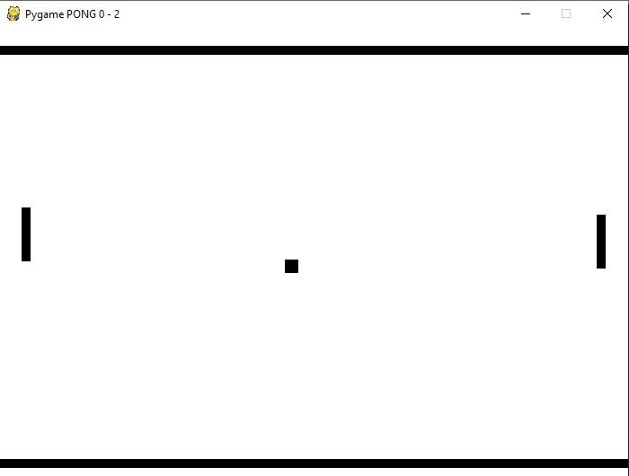
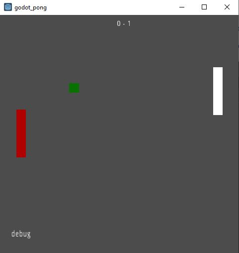

## Raportti - Pelimoottorit

[Takaisin sisällykseen](https://github.com/Shinpai/Peliteknologia)

* [Lataa pygame_pong](https://github.com/Shinpai/Peliteknologia/raw/master/Sykli%201%20Pelimoottorit/pygame_pong/pygame_pong_win32.zip)
* [Lataa godot_pong](https://github.com/Shinpai/Peliteknologia/raw/master/Sykli%201%20Pelimoottorit/godot_pong/godot_pong.zip)

HUOM : pygame versiota pelataan nuolinäppäimillä, godot versiota W, S näppäimillä

Lähdin tekemään ensimmäistä versiota pygame-moottorilla, koska python on tuttua kauraa ja olen kuullut pygamesta aikaisemmin. Nappasin netistä template filun nopeuttamaan prosessia. Tämä antoi minulle käytännössä tyhjän mustan ruudun valmiiksi konfiguroituun ikkunaan kun tiedoston ajoi.

Tämän jälkeen rupesin hahmottelemaan core looppia ja mitä siihen tarvitaan. Kävin katsomassa annettua khanacademy linkkiä tueksi ja sain niiltä pohjilta oman pseudokoodiversion valmiiksi (lue: python versio). 

Suurimmat kompastuskivet pygamen kanssa oli sen paketointi, jonka kanssa piti turvautua erillisiin kirjastoihin. Käytin tässä cx_Freeze pakettia apuna. Sen konfigurointia hetken tuumailtua sain windowsilla ajettavan paketin ulos.

*pygame pong*

Pygame-version paketoinnin jälkeen rupesin miettimään millä tekisin toisen version ja päädyin siihen, että haluaisin koettaa beta-versiossa olevaa Amazonin Lumberyard- ympäristöä joka ilmeisesti pohjautuu CryEngineen. Sen kanssa muutaman tunnin räpellettyä, totesin että ei ole ihmisten hommaa ja rupesin etsimään vaihtoehtoista ympäristöä.

Päädyin godot:iin (https://godotengine.org/) joka vaikutti suht Unitymaiselta, joten ajattelin sen olevan tutumman oloinen mutta silti uusi ympäristö johon tutustua. 

Oikea "työ" oli jo pythonpuolella minulla tehty (core loop), joten godotin kanssa tarvitsi lähinnä selvittää miten ympäristökohtaiset asiat toimivat. Suurin osa godotin kanssa meni siis dokumentaation pläräykseen, se oli onneksi ihan asiallinen ja vielä kiinnitettynä ympäristöön joten sitä oli nopea käyttää.

Ympäristössä oli joitain hämmentäviä ratkaisuja, joiden selvittäminen vei aikaa. Esimerkiksi kameran kanssa oli ihmettelemistä. Toisaalta siitä löytyi oikein hyviä puolia joista pidin: oma skriptikieli, todella yksinkertainen "pythonmainen" kieli jonka käytön oppi nopeasti. Exporttaus todella hyvä ja simppeli, pystyi valitsemaan templatesta haluaako Windows, HTML, Android ym ajettavan paketin. Myös sisäinen dokumentaatio oli hyvä ja todella nopea käydä tarkistamassa asioiden tila.

*godot engine pong*
