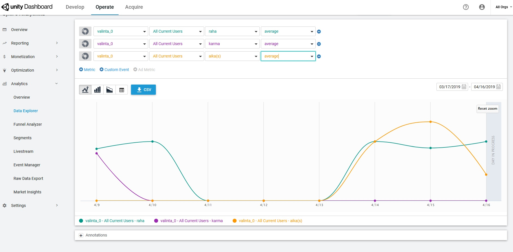
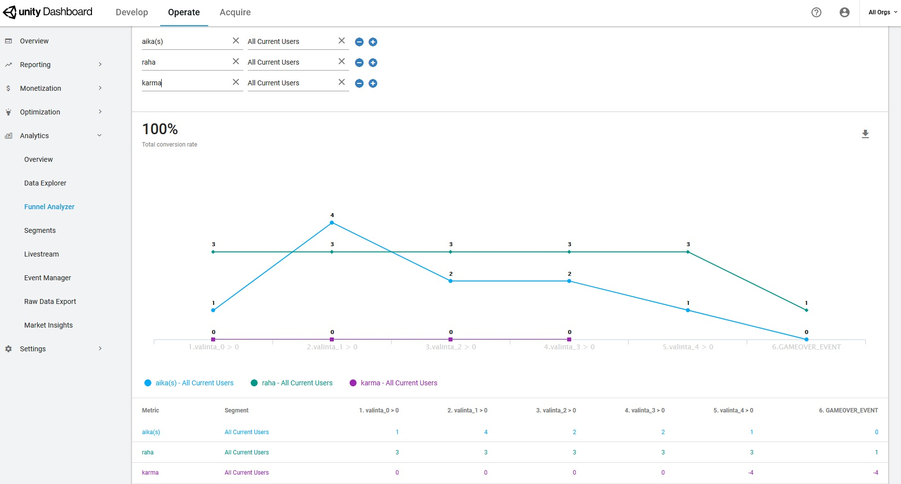
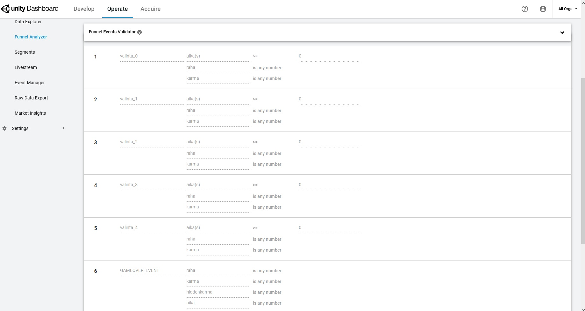

## Raportti - Analytiikkatyökalut

[Takaisin sisällykseen](/)

Aloitin siitä, että koetin peliä muutaman kerran. Sen jälkeen löin analytiikan päälle ja rupesin kurkkimaan dokumentaatiota siitä, miten parametrit saa kulkemaan niiden kanssa. Päätin jo suht alussa, että teen mieluummin koodin sisään event-kutsun kuin rupean säätämään komponentteja gameobjectien sisään. Näin ollen piti siis ruveta katselemaan koodia ja missä vaiheessa mikäkin suoritetaan.

Ensimmäisen pisteen suoritus oli helposti tehty dokumentaation avulla, seuraavaksi rupean katsomaan saisiko funnelia varten eri valintojen eventit tehtyä "koodillisesti" vai pitääkö tukeutua komponentteihin. 

--> Tein buttonscriptiin eventin joka triggeroituu kun nappia painetaan ja antaa numeroidun valinnan analytics eventtinä. Sitten tein funnelin, jossa valinnat 1-4 ja gameover. Funnel näyttäisi toimivan muuten, mutta ei rekisteröi "karma"- resurssia vaikka se on tehty samalla tavoin kuin muut resurssit eli haettu GameController luokalta.

